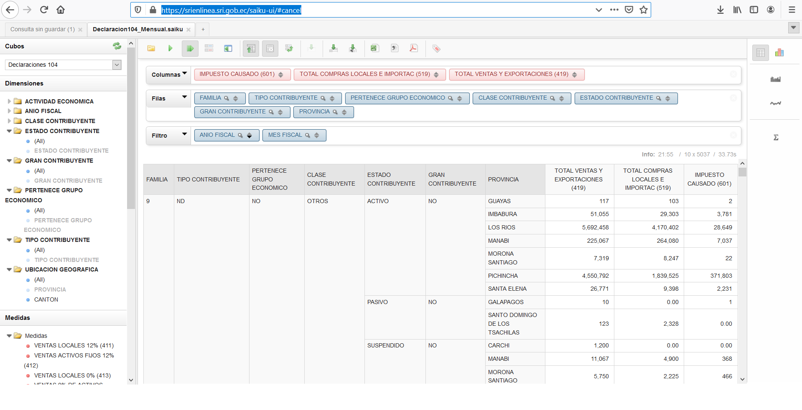

```{r setup, include=FALSE}
options(htmltools.dir.version = FALSE)
```


# Principio de los datos ordenados (Tidy data)

"Tidydatasets provide a standardized way to link the structure of a dataset (its physical layout)with its semantics (its meaning)."
   -  Hadley Wickhamn, [Tidy Data](https://vita.had.co.nz/papers/tidy-data.pdf) 

Reglas generales:

1.  Una variable forma una columna
2.  Una observación forma una fila
3.  Cada unidad observacional forma una tabla

¿Cuando no hablamos de *tidy data*?

- Los nombres de las columnas son valores, no nombres de variable
- Varias variables en una misma columna
- Varias unidades observacionales en una misma tabla
- Una misma unidad organizacional en varias tablas
---
# Saiku

[Saiku](https://srienlinea.sri.gob.ec/saiku-ui/#cancel) es un sistema implementado por el Servicio de Rentas internas para consultar valores agregados de las cuentas fiscales considerando distintas agregaciones. Para esta presentación se realizó la siguiente consulta:



---

## Lectura del archivo:

`R-Base` tiene sus propias funciones de lectura de archivos, cualquiera de estas funciones emplea lógicas de coerción:

```{r}
tabla <- read.csv("saiku-export.csv")
```

Nombres de las columnas:

```{r}
names(tabla)
```

---

# Clase/tipo de cada columna

`lapply` aplica una función sobre una `lista` o un `data.frame` y devuelve una lista nombrada con el resultado de la función aplicada:

```{r}
clases <- lapply(tabla,function(x)class(x))
str(clases)
```

---

>`sapply` es una variante de `lapply` pero simplifica al tipo más simple de objeto, `vapply` realiza la misma operación salvo que permite definir el tipo de resultado que se desea.

# Función 'which'

Devuelve las posiciones de una vector y devuelve las posiciones que cumplen dicha condición:
```{r}
vector <- sample(1:90,30)

ind <- which(vector %% 4 == 0)

vector[ind] <- 0 

vector
```
---

# Series de tiempo sencillas

```{r}
# Creo una serie de tiempo con el total de ventas:
vt_ts <- ts(rnorm(36),start = 2015,end = 2017,frequency = 12)

vt_ts

```

---

# Prueba de independencia

```{r}
Box.test(vt_ts ,type = "Ljung-Box" )
```


# Diferenciación:
```{r}
# Diferencio la serie con 12 retardos:
vt_dff <- diff(vt_ts,lag = 12)

vt_dff
```

---

# Función 'aggregate'

```{r, eval = FALSE}

comp <- aggregate(formula = ventas_t ~ fecha + s_petro,
          data = tabla,
          FUN = function(x) sum(x)/10e6)

head(comp)

```

# Conteo simple

```{r}
table(tabla$FAMILIA)
```


---
# Ejercicio:

Quiero comparar las compras de las tres regiones naturales: 

  1. Genero una variable que se llame región natural
  
  [Hint:]() Utilizar la función `which` para encontrar las posiciones de las provincias que pertenecen a cada región.
  
  2. Agrego las compras por fecha y región natural
  
  [Hint:]() Utilizar la función `aggregate` para encontrar las sumas agrupadas por fecha y region natural.
  
  3. ¿Durante que mes entre marzo y mayo de 2016 tuvieron las compras más bajas las distintas regiones?  
   
  <font color = '#d7215b'>Hint:</font> Filtro la tabla para las fechas señaladas, empleo la función `split` para guardar en una lista la información de cada una de las regiones. Con `lapply` y la función `which.min` hallo la el mes en que se presenta el minimo  

---
class: inverse, center, middle

# Gracias
